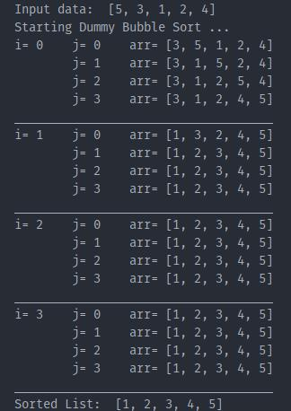

# Bubble Sort

Three variations of bubble sort implemented with Python. The code outputs step by step output for bigginers to understand.

|                 Dummy Bubble Sort                  |              Traditional Bubble Sort               |               Optimized Bubble Sort                |
| :------------------------------------------------: | :------------------------------------------------: | :------------------------------------------------: |
|  |  |  |
